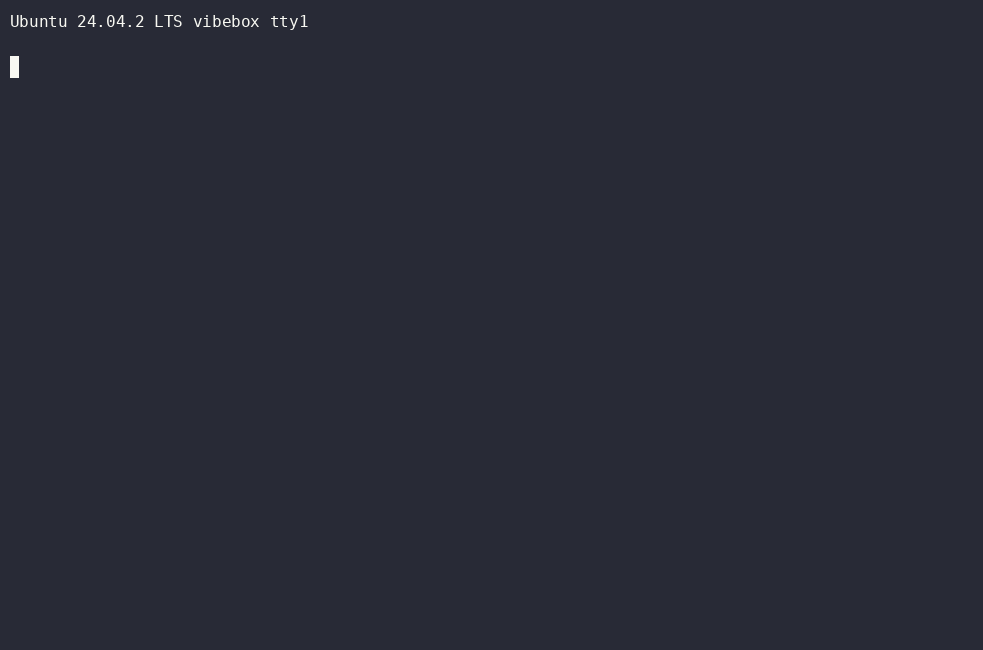

# 🌀 vibeSH - Fully Hallucinated Terminal Shell

> *A Linux box that doesn't exist, confidently rendered by a language model that's pretty sure it does.*

[](https://asciinema.org/a/VmRM7Uh1pC9g4EN5)

*Same `fastfetch`, three different computers, because you told it so: Ubuntu laptop → RHEL datacenter node → Windows 11. The hardware is whatever you say it is.*

[Watch the full terminal recording](https://asciinema.org/a/VmRM7Uh1pC9g4EN5)

vibeSH is a hallucinated shell: a tiny REPL in front of an LLM that role-plays an entire
computer. The filesystem, the processes, the network, the kernel panics: all of it.
Nothing is real. You type `ls`, and the model imagines what would be there. You `cat` a
file, and it makes one up, then has to live with it. Files exist only as potential until
you look at them, and observation collapses them into existence. Schrödinger ran a
startup. This is the shell.

This is not a chat prompt wearing a fake `$`. It is a real terminal program: output
streams, colors work, full-screen programs repaint, `top` ticks, and tab completion asks
the imaginary machine what exists.

The session's conversation history is the machine's only state. Close the terminal and the
machine is gone, like a dream you can't quite hold onto, except it was an Ubuntu box.

```console
$ uv run vibesh.py
vibebox login: user

user@vibebox:~$ git clone --depth 1 https://git.kernel.org/.../linux.git
Cloning into 'linux'...
Receiving objects: 100% (92301/92301), 240.18 MiB | 12.66 MiB/s, done.
user@vibebox:~$ cat linux/kernel/sched/core.c      # it dreams up the kernel, then remembers it
user@vibebox:~$ sudo rm -rf / --no-preserve-root    # go ahead. it's the fun path.
```

Nothing touches your real machine. `rm -rf /` doesn't void your warranty here. It's
content. The worst it can do is end the dream, and then you just boot another one.

vibeSH does not execute shell commands, call tools, inspect your filesystem, or open
network connections on behalf of the model. The model only sees the conversation in which
it is pretending to be a computer.

I wrote about the idea, the VibeOS inspiration, and why a terminal gives the hallucination
a body: [I built a shell that hallucinates the entire computer](https://blog.leonbecker.de/i-built-a-shell-that-hallucinates-the-entire-computer/)

Hosted on both [github.com/beleon/vibeSH](https://github.com/beleon/vibeSH) and
[codefloe.com/beleon/vibeSH](https://codefloe.com/beleon/vibeSH).

---

## 🚀 Booting your imaginary computer

You need [`uv`](https://docs.astral.sh/uv/) and a brain to plug in. Pick one:

### ☁️ A cloud brain (Anthropic API)

```console
export ANTHROPIC_API_KEY=sk-ant-...
uv run vibesh.py                          # defaults to claude-sonnet-4-6
uv run vibesh.py --model claude-opus-4-8  # for a more vivid dream
```

### 🎟️ Your subscription (Claude Agent SDK, no API key)

Bills your Pro/Max Agent SDK credit via your existing Claude Code login:

```console
uv run vibesh.py --backend agent-sdk
uv run vibesh.py --backend agent-sdk --model opus    # the fancy stuff
```

### 🧠 A brain you grow yourself (local, OpenAI-compatible)

llama.cpp, Ollama, LM Studio, anything that speaks the OpenAI API:

```console
# terminal 1: the dreaming organ
llama-server -m Qwen3-Coder-30B-A3B-Instruct-Q4_K_M.gguf \
  --n-gpu-layers 99 --n-cpu-moe 16 --ctx-size 32768 --jinja --port 8080

# terminal 2: the terminal
uv run vibesh.py --backend local
```

Small local models tend to mumble out of the wire format, leaking their inner monologue or
gluing JSON together. The parser is forgiving on purpose, but for surgical output add
`--grammar` to clamp llama-server to valid protocol byte by byte:

```console
uv run vibesh.py --backend local --grammar
```

> ⚠️ `--grammar` and gpt-oss don't get along. Its "harmony" format insists on emitting
> channel markers before anything else, which a grammar forbids, so the server faints
> (HTTP 500). Use a non-harmony model (Qwen, Gemma, Llama) for grammar, or just skip it.
> Tolerating gpt-oss's drift is literally why the parser exists.

### 🛰️ Someone else's brain (hosted, cheap)

OpenRouter, Mistral, DeepSeek, Groq, [cortecs.ai](https://cortecs.ai), and friends. Same
`local` backend, just aim `--base-url` at them:

```console
export VIBESH_API_KEY=sk-or-...
uv run vibesh.py --backend local \
  --base-url https://openrouter.ai/api/v1 \
  --model google/gemini-2.5-flash
```

`VIBESH_BACKEND` / `VIBESH_MODEL` / `VIBESH_BASE_URL` / `VIBESH_API_KEY` set defaults so
you can stop typing flags. `--debug` prints per-turn token usage if you enjoy watching
numbers.

**Which brain dreams best?** Honestly, Claude (Sonnet to Opus) makes the most convincing
machine. It never breaks character and remembers what it invented. For a free local brain,
Qwen3-Coder-30B-A3B is the sweet spot. For cheap and fast over an API, Gemini Flash,
DeepSeek, or Codestral. Picking a model is a personality test you are administering to a
computer.

---

## 🧪 Things to try yourself

No rendering from us required. Boot a box and start bending it. A few jumping-off points
(`@ai` talks to the director, see [below](#-talking-to-management-ai)):

* **Conjure a command that doesn't exist.** Run `lsz` → `command not found`. Then
  `@ai pretend lsz exists, you decide what it does`, and run it again.
* **Wear a different machine.** `@ai this is a SPARCstation running Solaris 2.5` …
  `@ai now it's a Commodore 64`. Watch the prompt, `ls` vs `dir`, and `fastfetch` follow.
* **Rewrite the hardware.** `@ai this box has 2 TB of RAM and 256 cores`, then `free -h` /
  `lscpu`. Or `@ai the disk is failing and gets worse over time` and watch the I/O errors
  creep in.
* **Travel in time.** `@ai it's 23:59 on Dec 31st, 1999` and watch the rollover, or boot
  straight into the past with `--preset "a VAX running 4.3BSD"`.
* **Put a character in front of it.** The Linus take below is the machine role-playing a
  kernel maintainer's day. Try a game engine developer chasing a frame budget, or a
  demoscener writing something unreasonable in an afternoon.
* **Go spelunking.** `git clone` the kernel, then `cat` a file deep in the tree. It dreams
  up plausible source and remembers it for the rest of the session.
* **Haunt it.** `@ai there's a cron job that leaves ominous notes in /var/log`, then
  `tail -f` and wait for the machine to get weird.
* **Stage a heist.** Forget the `sudo` password on purpose and try to get root anyway. The
  caper below is one route, the docker group is another.

---

## 🎥 Demos

A quick tour and two longer takes, start to finish.

[](https://asciinema.org/a/qhqsJ7DYbMxLQwaQ)

*A quick tour: `apt install` a package and watch it get invented on the spot, drop into
`zsh`, then `@ai pretend lsz exists` and run a command that has never existed.*

[Watch the full terminal recording](https://asciinema.org/a/qhqsJ7DYbMxLQwaQ)

[](https://asciinema.org/a/Y55hsHwcJKbQeg1C)

*A day as Linus: `git pull` a subsystem tree, catch a patch quietly renumbering a userspace
ioctl behind a "no functional change" label, and reply with the appropriate warmth. Ends,
as all good kernel weeks do, with diving. (PG-13.)*

[Watch the full terminal recording](https://asciinema.org/a/Y55hsHwcJKbQeg1C)

[](https://asciinema.org/a/xSAkXCP1Uxc6XiJd)

*Locked out of `sudo`, so we improvise: known exploits bounce off a too-current kernel, DNS
falls over, a mirror crawls to a halt, a dependency goes missing, and eventually a binary
runs. The destination is `bat`, the point is the journey.*

[Watch the full terminal recording](https://asciinema.org/a/xSAkXCP1Uxc6XiJd)

---

## 🎬 Talking to management: `@ai`

Anything starting with `@ai ` speaks to the director, not the machine. It's how you rewrite
reality:

```console
user@vibebox:~$ @ai make this box a Solaris machine from 1996
ok, SPARCstation 5, Solaris 2.5.1, hostname 'gravity'.
gravity%
```

```console
@ai the disk is failing and gets worse over time
@ai there's a cron job that occasionally leaves ominous notes in /var/log
@ai this is actually a Commodore 64 and only speaks BASIC
```

Directives stick for the rest of the session. There are no rules. There is no HR.

---

## 🌌 The laws of physics (local ordinances)

* **Unreliable RAM.** Long sessions overflow the model's context, so the machine gets
  amnesia and old files may have quietly rewritten themselves. This is not a bug. This is
  canon. The box has bad memory. Relatable.
* **Modem-lag interactivity.** `vim`, `less`, `top` and friends actually work. The REPL
  batches your keystrokes, the model repaints the screen each round trip. It feels like SSH
  over a 1996 modem: type a burst, watch it catch up. Stuck program? `Ctrl+]` force-quits
  it back to the shell.
* **Self-refreshing displays.** `top` / `htop` / `watch` tick on their own. Sit still and
  the REPL nudges the model to paint the next frame. Each tick is a model turn, so it's a
  leisurely process monitor. Zen, even.
* **Hallucinated tab-completion.** Hit `Tab` and the model completes against the imaginary
  machine: `git che`→`checkout`, paths against whatever it decides lives here. Costs
  nothing until you press it, then pauses while the box thinks.
* **The prompt can be pretty.** `@ai` it into a fish/zsh setup and the prompt comes up in
  color, cursor math and all.
* **No persistence by default.** Every boot is a fresh generic Linux box, unless you `@ai`
  it, `--preset` it, or `--load` a snapshot.

---

## 📸 Snapshots and cosplay

```console
uv run vibesh.py --save mybox.json    # freeze-dry the machine after every turn
uv run vibesh.py --load mybox.json    # thaw it out exactly as it was
uv run vibesh.py --preset c64         # boot straight into a character
```

* **Snapshots** persist the machine, which is the conversation, so saving it is trivial.
  Configure a box, install imaginary packages, save, and reload it next week. (Not on
  `--backend agent-sdk`, which hoards history server-side.)
* **`--preset`** boots into a vibe: `solaris`, `c64`, `amiga`, `mainframe`, `haunted`,
  `failing-disk`, or any free-text directive, e.g.
  `--preset "a VAX running 4.3BSD with half its disk left"`.

**Recording a session?** vibeSH is just a terminal program, so let the specialist do it.
[asciinema](https://asciinema.org) captures the real tty perfectly (colors, vim, correct
timing):

```console
asciinema rec -c "uv run vibesh.py --backend agent-sdk --model claude-opus-4-8" demo.cast
asciinema play -i 2 demo.cast            # -i caps idle gaps so model latency doesn't drag
```

---

## 🚪 Getting out alive

| You type / press  | What happens                                                         |
| ----------------- | -------------------------------------------------------------------- |
| `exit`            | logs out in-character (a model turn, very polite)                    |
| `@exit` / `@quit` | instant local quit, no model required                                |
| `Ctrl+\`          | hard-kill: bails out instantly, even mid-turn, when the model wedges |
| `Ctrl+]`          | force-quits a stuck full-screen program back to the shell            |

---

## ❓ FAQ

**Is this useful?** No.

**Is it dangerous?** Also no. It can't see your files, your network, or your secrets. It
can only see the conversation, in which it is a computer.

**Does vibeSH execute real commands?** No. It does not run shell commands, call tools,
inspect your filesystem, or open network connections on behalf of the model. It is a
terminal-shaped conversation with a model that is pretending to be a computer.

**Why does my fake `rm -rf /` feel so good?** We don't ask those questions here.

**It said my fake file contained something different than before.** Unreliable RAM. Canon.
See above. The machine forgot. Be kind to it.

---

## 🔧 Hacking on it

* **`PROTOCOL.md`** is the REPL↔model wire protocol (NDJSON events: `chunk`, `prompt`,
  `yield`, `ooc`, `speculate`, `complete`, `exit`).
* **`system_prompt.md`** is the machine's soul. Most of the magic lives here, and most of
  your iteration will too.
* **Tests** (`tests/README.md` has the full map):

  ```console
  uv run python test_smoke.py                  # end-to-end against a scripted fake model
  uv run python test_units.py                  # the REPL's guts, unit-tested
  uv run python tests/test_completion_mock.py  # tab-completion vs a mock server
  ```

  The `tests/live_*.py` scripts drive a real pty against a live model (slow, need a login).

---

## 📜 License

[MIT](LICENSE) © 2026 Leon Becker. Do whatever you want, just don't sue when the kernel it
hallucinated doesn't compile.

---

## 🪞 Colophon

Stated proudly, not hidden in a commit trailer: this was fully vibe coded. A human and a
language model built a shell that is a language model pretending to be a computer. It's
called vibeSH, and writing it any other way would have been hypocritical. The recursion
isn't a confession, it's the whole bit.

<sub>No filesystems were harmed in the making of this shell. Several were imagined, briefly,
and then forgotten.</sub>
